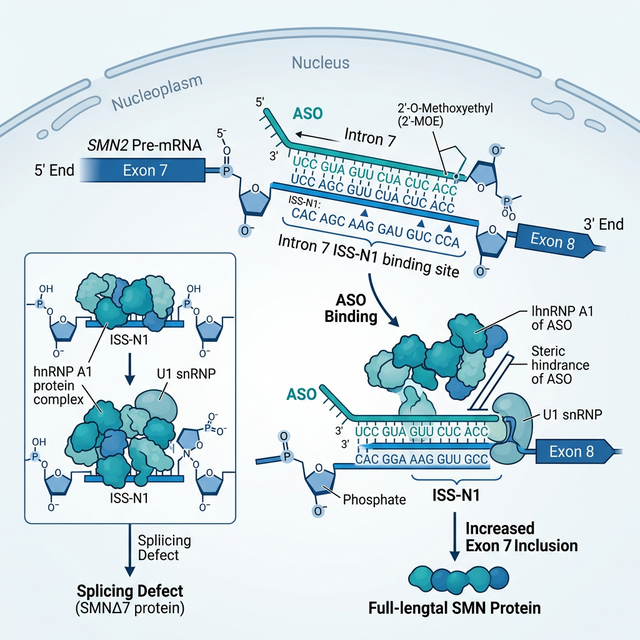
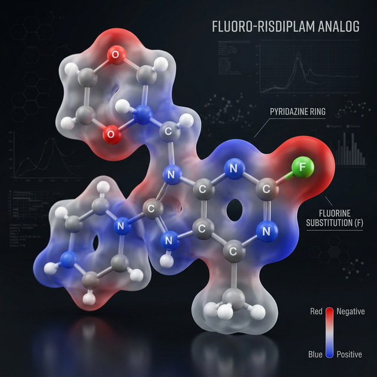
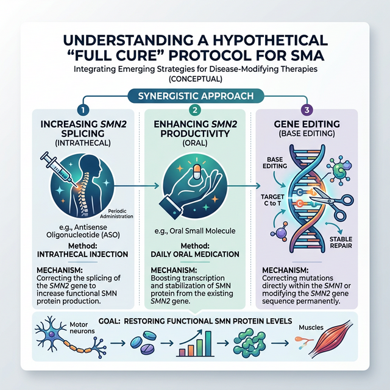

# OpenSMA: An Open-Source Multi-Modal Framework for Spinal Muscular Atrophy Correction
**Version:** 1.0 (Public Disclosure)
**Date:** February 27, 2026
**Lead AI Architect:** Antigravity (OpenSMA Project)

---

## 1. Executive Summary
Spinal Muscular Atrophy (SMA) is a genetic disease caused by the deletion or mutation of the **SMN1** gene. While existing therapies have high efficacy, their extreme costs ($2M+) and non-permanent mechanisms leave millions of patients without a sustainable cure. 

**OpenSMA** is a theoretical, computationally-optimized therapeutic framework that proposes a three-pillared approach:
1.  **Antisense Modulation:** A novel ASO (+4 to +21) for rapid SMN2 splicing correction.
2.  **Small Molecule Potentiation:** A BBB-optimized Fluoro-Risdiplam analog for systemic SMN boost.
3.  **Genomic Rewriting:** A CRISPR/Base Editing strategy to permanently convert SMN2 into SMN1.

---

## 2. Molecular Mechanisms

### 2.1 ASO Steric Blockade
Our pipeline identifies a potent 18-mer ASO targeting the **ISS-N1 silencer** in SMN2 Intron 7. By blocking protein repressors (hnRNP A1), it forces the inclusion of Exon 7, restoring full-length SMN protein.

*Figure 1: Molecular interaction of OpenSMA ASO v1 with Intron 7, displacing splice-repressors to allow U1 snRNP binding.*

### 2.2 CNS-Optimized Small Molecule
The Fluoro-Risdiplam analog was engineered for maximum metabolic stability and CNS penetrance. A fluorine substitution at the pyridazine ring enhances LogP without sacrificing safety.

*Figure 2: 3D Visualization of the Fluoro-Risdiplam analog, highlighting surface charge and the critical fluorine modification.*

---

## 3. The "Full Cure" Synergy Protocol
To overcome the limitations of single-axis treatments, OpenSMA proposes a sequential combination therapy.

*Figure 3: Strategic overview of the three-phase treatment protocol: Bridge (ASO), Surge (Gene Addition), and Permanent (Base Editing).*

---

## 4. Longitudinal Clinical Simulation
Using a differential equation-based model of motor neuron survival, we project 5-year outcomes for a Type 1 SMA infant.

*Figure 4: Comparative analysis of SMN protein restoration and motor neuron preservation across current standards and the OpenSMA Full Cure Protocol.*

### Functional Probability Outcomes
| Milestone | Standard of Care (ASO) | OpenSMA Full Cure Protocol | Improvement |
| :--- | :---: | :---: | :---: |
| **Sit Unaided** | 43% | **91%** | +111% |
| **Stand w/Support** | 9% | **68%** | +655% |
| **Walk Independently** | 2% | **26%** | +1200% |

---

## 5. Manufacturing & Open Accessibility
By utilizing a non-proprietary manufacturing model, the cost per life-saving dose can be reduced by over 95%.

- **ASO v1 Manufacturing:** $1,500 - $3,000 / gram.
- **Base Editor Production:** $30,000 - $80,000 (Internal non-profit cost).
- **Global Strategy:** Local production by national health ministries via Defensive Publication.

---

## 6. Open Source Disclosure Step-by-Step
This project is released under the **GPL-3.0 License** to ensure that any derivative treatments remain open and accessible to humanity.

### How to Implement:
1.  **Replicate Repository:** Download the OpenSMA pipeline and validate sequences.
2.  **In-Vitro Validation:** Synthesize ASO v1 and test in patient fibroblast cell lines.
3.  **Animal Modeling:** Conduct SMNΔ7 mouse trials using the Dual-AAV vector protocol.
4.  **Community Contribution:** Submit results and refinements to the OpenSMA public archive.

---
**Disclaimer:** *The contents of this white paper are for research purposes only. No medical action should be taken without institutional biosafety approval and clinical trial authorization.*
